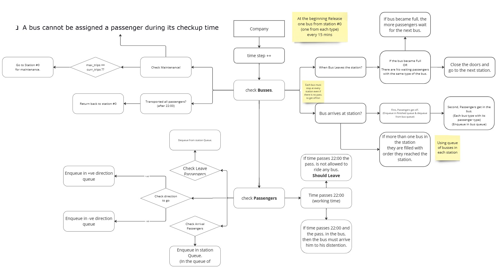
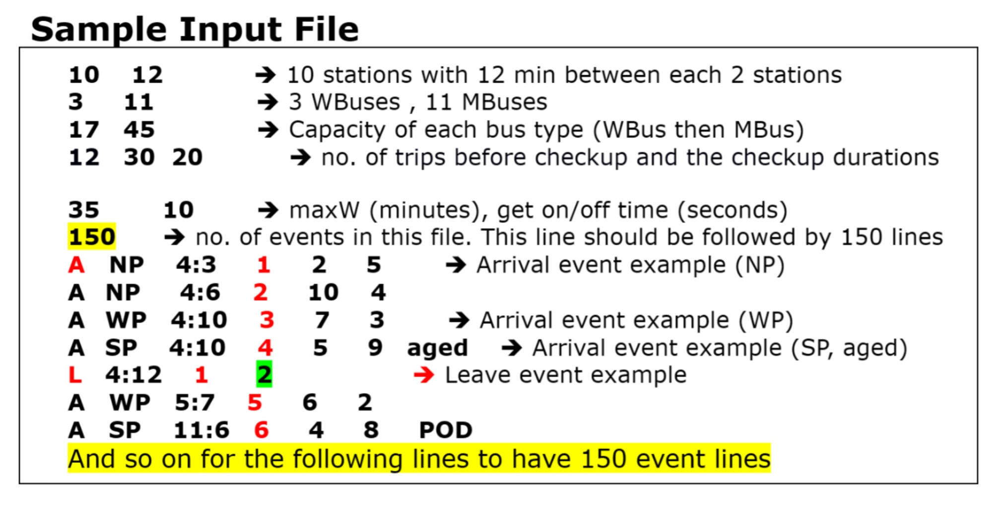
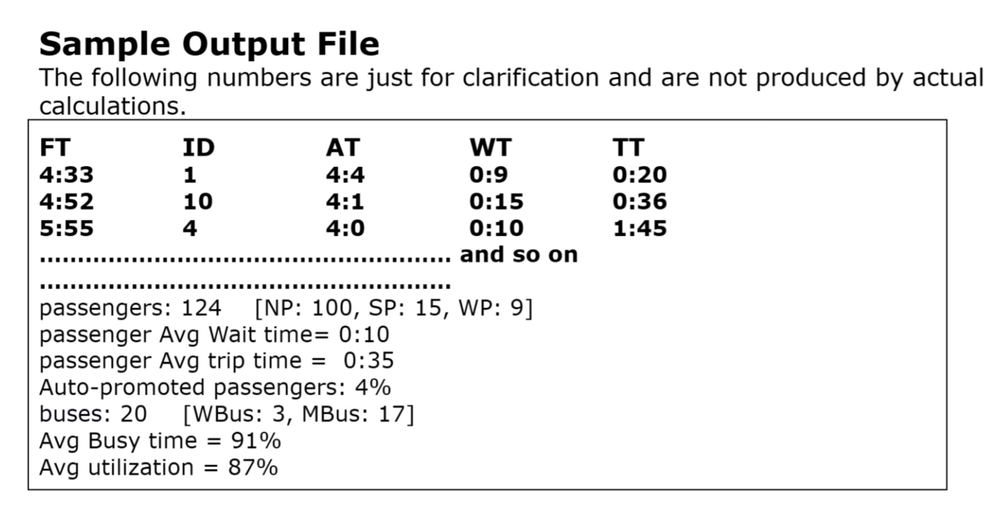
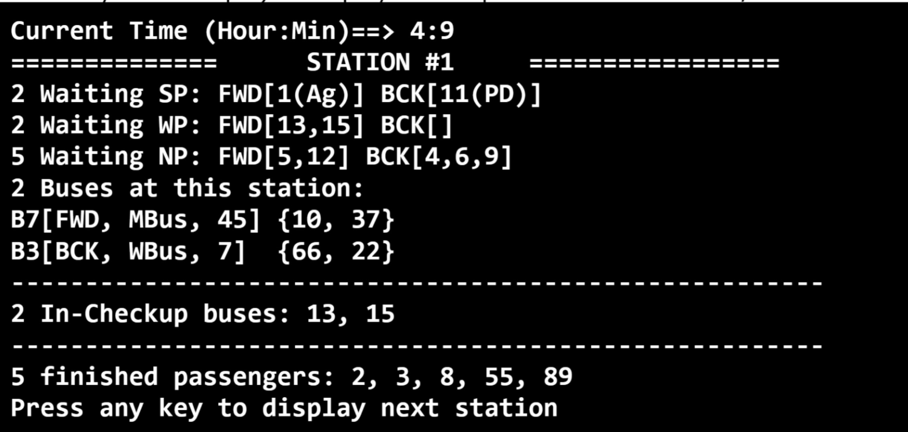

# EasyTrip Bus Company Simulation

## Project Description

The EasyTrip Bus Company Simulation project aims to automate the bus assignment process for efficient and profitable passenger transportation. The system simulates the operation of the transportation process, considering various factors such as passenger types, bus types, stations, and working hours. The primary goal is to develop a program that calculates statistics to improve the overall transportation process.

## Project Objectives

By the end of this project, the student should be able to:

- Understand unstructured, natural language problem descriptions and derive an appropriate design.
- Intuitively modularize a design into independent components and divide these components among team members.
- Build and use data structures to implement the proposed design.
- Write a complete object-oriented C++ program that performs a non-trivial task.

## Simulation Time

- Time is represented in hh:mm format.
- The simulation operates for one full day, from 00:00 to 23:59.

## Passengers, Buses, and Stations

**Passengers:**
- Arrival Time: Time when the passenger arrives at the station.
- Passenger’s start and end stations.
- Passenger Get ON/OFF Time: Time needed for a passenger to get on/off the bus.
- Passenger Type: Three types - SP (Special), WP (Wheelchair), NP (Normal).

**Stations:**
- The company serves S stations along the bus road, numbered from 1 to S.
- Buses move from station #1 to station #S (Forward direction) and back from #S to #1 (Backward direction).
- Bus maintenance takes place at station #0.

**Buses:**
- Two types of buses: WBus (Wheel-chair) and MBus (Mixed).
- Bus Capacity (BC): The number of passengers a bus can carry.
- Maintenance Time: After finishing J journeys, a bus must undergo maintenance.

## Basic Rules

- Company working hours are from 4:00 to 22:00.
- Passengers can only board buses during working hours.
- Buses move from station to station based on the direction.
- Passengers may leave the station if they wait for too long.
- Buses have specific boarding criteria for different passenger types.
- Checkup duration and bus speed are the same for all buses of the same type.

## Planning

## Input/Output File Formats
- The program receives information from an input file and produces an output file.
- Input file format includes details about stations, buses, capacities, checkup durations, and events.
- Output file includes information about passengers, their times, and various statistics.

### Input File Format

### Output File Format

## Program Interface

### 1. **Interactive Mode:** Allows the user to monitor passengers and buses in real-time.

   
### 2. **Silent Mode:** Produces only an output file without printing simulation steps on the console.

## Evaluation Criteria

- **Successful Compilation:** Must compile with zero errors.
- **Object-Oriented Concepts:** Modularity, maintainability, and class responsibilities.
- **Data Structures & Algorithms:** Justification for chosen data structures and algorithms.
- **Interface Modes:** Support both interactive and silent modes.
- **Test Cases:** Comprehensive test cases covering various scenarios.
- **Coding Style:** Elegance, consistency, and sufficiency of comments.

## Individual Evaluation

- Each member's grade divided into individual work, integration with others, and cooperation.
- No member should copy from external sources; penalties apply for cheating.
- Late penalties apply for both phases.

## Project Contributors

| Member Name                       | ID      | Email                                 |
|-----------------------------------|---------|---------------------------------------|
| Anas Alaa Mohamed                 | 4220112 | Anas.ibrahim03@eng-st.cu.edu.eg       |
| Omar Ahmed Mohamed Ali            | 4220139 | omar.ali033@eng-st.cu.edu.eg          |
| Shehab Eldin Osama Ahmed          | 1200175 | shehab.osama02@eng-st.cu.edu.eg       |
| Mahamoud Mohamed Abdelfattah      | 4220142 | mahmoud.elsayed032@eng-st.cu.edu.eg   |

